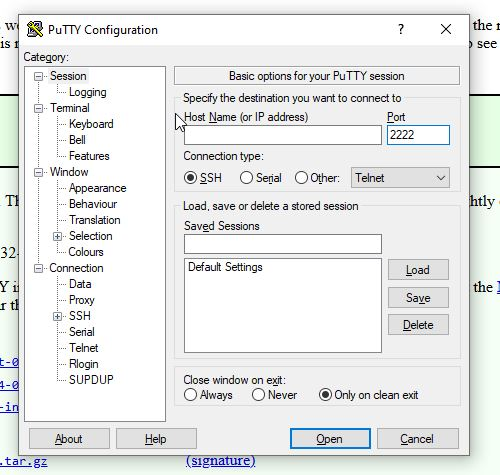
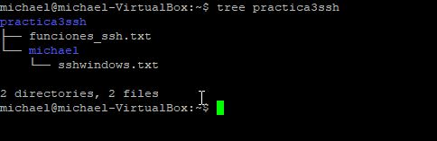
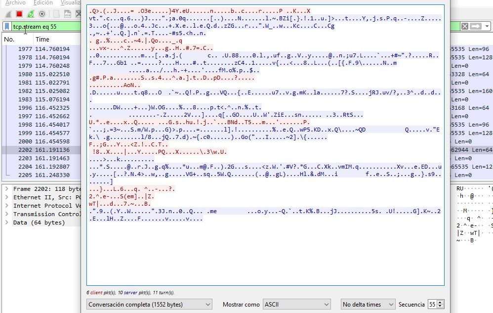
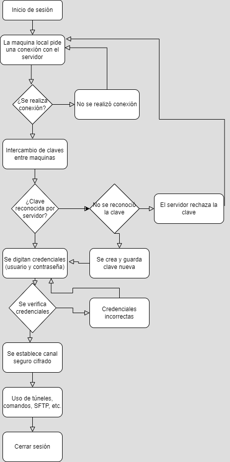

# Laboratorio Avanzado de Sistemas Operativos

## Grupo:

- Michael Posada Castañeda

## Antonio José Camacho

## Programa Académico

**Ingeniería de Sistemas**  
**Materia:** Sistemas Operativos  
**Fecha:** 7 de abril de 2025

## Índice

1. [Introducción y Objetivos](#introducción-y-objetivos)
2. [Requisitos y Entorno](#requisitos-y-entorno)
3. [Paso 1: Configuración Segura de SSH](#paso-1-configuración-segura-de-ssh)
4. [Paso 2: Configuración del Cliente PuTTY](#paso-2-configuración-del-cliente-putty)
5. [Paso 3: Gestión de Carpeta y Permisos de Usuarios](#paso-3-gestión-de-carpeta-y-permisos-de-usuarios)
6. [Paso 4: Gestión y Control de Grupos y Usuarios](#paso-4-gestión-y-control-de-grupos-y-usuarios)
7. [Paso 5: Análisis y Comparativa entre FTP y SSH con Wireshark](#paso-5-análisis-y-comparativa-entre-ftp-y-ssh-con-wireshark)
8. [Conclusiones y Observaciones](#conclusiones-y-observaciones)
9. [Informe: Ventajas de SSH](#informe-ventajas-de-ssh)
10. [Diagrama de flujo](#diagrama-de-flujo)

### Introducción y Objetivos

Este laboratorio tiene como propósito explorar y configurar de forma segura los servicios de acceso remoto y transferencia de datos en un entorno Linux. Se enfoca en el uso del servidor SSH para asegurar la comunicación remota, la configuración del cliente PuTTY en Windows para acceder a Ubuntu, la administración de permisos y usuarios, además de la comparación de protocolos de transferencia (FTP vs SSH) mediante herramientas de análisis de red.

### Requisitos y Entorno

- Sistema Operativo de la Máquina Servidora: Ubuntu (virtualizado en VirtualBox)

- Sistema Operativo del Cliente: Windows (usando PuTTY)

- Software Requerido:

  - Servidor SSH (OpenSSH)

  - PuTTY (cliente SSH para Windows)

  - Wireshark (herramienta de monitoreo de red)

  - Servidor FTP (para comparar con SSH)

### Paso 1: Configuración Segura de SSH

1.1 Instalación del Servidor SSH
Acción: Instalar el servidor SSH para permitir conexiones remotas seguras.

Verificación Inicial:
Asegúrese de que el paquete del servidor SSH esté instalado en el sistema Ubuntu.

1.2 Modificación del Archivo de Configuración
Archivo: /etc/ssh/sshd_config

Procedimiento:

sudo nano /etc/ssh/sshd_config

Guardar los cambios realizados en el archivo.

### Paso 2: Configuración del Cliente PuTTY

2.1 Instalación y Configuración Inicial
Instalar PuTTY:
Descargar e instalar la última versión de PuTTY en la máquina Windows.

c

Preparación de Conexión:

Determinar la dirección IP de la máquina Ubuntu.
Nota: La máquina Ubuntu se ejecuta en VirtualBox, por lo que es esencial ajustar la configuración de red (adaptador puente o NAT según sea necesario) para permitir la conexión desde Windows.

Revisar y confirmar la IP asignada a Ubuntu para evitar conflictos de red.

2.2 Proceso de Conexión Mediante PuTTY
Iniciar PuTTY:
Abrir PuTTY e ingresar la dirección IP de Ubuntu en el campo “Host Name (or IP address)”.

Configuración del Puerto:
En ocasiones, puede ser necesario cambiar el puerto de conexión, en este caso se mantiene el puerto por defecto (22) o el configurado en el servidor.

Inicio de Sesión:

Introducir las credenciales de usuario (usuario y contraseña) configuradas en Ubuntu.

Verificar que la conexión se realice correctamente.

2.3 Post-Conexión en PuTTY
Gestión del Acceso Remoto:

Una vez establecida la conexión, se procede a ejecutar comandos de administración.

Se realiza la modificación y el análisis de archivos de configuración y permisos para mejorar la seguridad del acceso remoto.

Creamos una carpeta con el nombre de usuario y accedemos al archivo de permisos para modificarlos.

Guardamos cambios y vamos a Putty

### Paso 3: Gestión de Carpeta y Permisos de Usuarios

3.1 Creación de la Carpeta de Trabajo
Nombre de la Carpeta: s_operativos

3.2 Creación y Configuración del Usuario "michael" y asignación de Permisos
Creación del Usuario y Asignación de Permisos, se procede a crear un usuario denominado michael, el cual permitirá realizar pruebas y configuraciones específicas en el entorno:

Se aplican 7 combinaciones de permisos utilizando el comando chmod.
Verificación de la Sincronización:

Revisamos que los cambios se apliquen en la maquina linux

Confirmar que las modificaciones realizadas desde la sesión remota (vía PuTTY) se reflejen correctamente en la máquina Ubuntu, garantizando que los cambios en permisos y propiedades sean efectivos.

### Paso 4: Gestión y Control de Grupos y Usuarios

4.1 Creación y Organización de Grupos
Creación de Grupos:
Crear los grupos solicitados en la práctica. Esto podría incluir nombres de grupos específicos definidos por el profesor.

Propósito:
Organizar a los usuarios según roles o funciones, facilitando la gestión de permisos y la administración del sistema.

4.2 Incorporación y Configuración de Usuarios
Agregar Usuarios a Grupos:

Incluir a los usuarios en los grupos previamente creados mediante comandos como:

4.3 Establecimiento de Contraseñas y Gestión de Cuentas
Contraseñas Seguras:

Asignar contraseñas robustas a cada usuario para garantizar la seguridad de sus cuentas.

Bloqueo y Eliminación:

Eliminación de Usuario 4:
El usuario identificado como “usuario 4” se elimina del grupo gruppoperativos.

Bloqueo del Acceso por SSH:

Se bloquea el acceso SSH para dicho usuario mediante la edición de su configuración de cuenta (por ejemplo, añadiendo un símbolo de exclamación ! al campo de la contraseña en /etc/shadow, lo que indica que la cuenta está deshabilitada).

Comprobamos que se elimino correctamente

4.4 Comprobación y Verificación

Utilizamos los comandos "/etc/group”, “/etc/passwd”, y “/etc/shadow”.

- /etc/group
  Contiene la información de todos los grupos del sistema.
  Muestra qué usuarios pertenecen a qué grupo.

- /etc/passwd
  Contiene información básica de cada usuario del sistema. Incluye: nombre de usuario, UID, GID, nombre completo, directorio home y shell.

- /etc/shadow
  Revisamos que su cuenta está bloqueada, lo está debido a que tiene un símbolo de exclamación en después del contenido de caracteres.

### Paso 5: Análisis de Conexiones y Comparativa entre FTP y SSH

5.1 Instalación y Uso de Wireshark
Instalación del Programa:

Instalar Wireshark en la máquina Ubuntu o Windows, según se requiera para capturar y analizar el tráfico.

Ejecución de Wireshark:

Abrir Wireshark y seleccionar la interfaz de red adecuada para iniciar la captura.

- Objetivo:

Observar y filtrar el tráfico, particularmente las conexiones provenientes del puerto 2222 (configurado para la conexión PuTTY en este laboratorio).

5.2 Conexión Remota en el Puerto 2222
Configuración de PuTTY:

Establecer una conexión utilizando PuTTY conectándose al puerto 2222.

Esto permite simular y analizar un escenario de conexión distinto al puerto por defecto.

Filtrado de Paquetes:

Utilizar Wireshark para filtrar y analizar únicamente el tráfico asociado al puerto 2222, evaluando la seguridad y la integridad de la comunicación.

5.3 Comparación entre FTP y SSH

#### FTP

Instalación y Configuración:

Se instala un servidor FTP en Ubuntu, el cual escucha en el puerto por defecto 21.

Aparte, conectamos el servidor en Windows por medio de la terminal.

Se inicia el servicio FTP y se confirma su funcionamiento.

Podemos observar que la informacion que pasa por las peticiones es accesible para todos, haciendo asi un hueco de seguridad.

- Seguridad:

Transmisión sin Encriptación:
Toda la información enviada a través de FTP se transmite en claro, lo que permite que cualquier interlocutor intercepte y lea los datos.

- Prueba de Conexión:

Se conecta desde la máquina Windows al servidor FTP, demostrando que la transmisión no está protegida.

#### SSH

- Características de Seguridad:

Encriptación Completa:
Toda la información enviada a través de SSH está encriptada, utilizando protocolos seguros (mencionado en el documento como TPS, que cumple la función de encriptar las peticiones y los datos).

#### Comparativa:

A diferencia de FTP, SSH ofrece una capa adicional de seguridad que dificulta cualquier intento de interceptación o acceso no autorizado.

Esta característica lo hace preferible en entornos donde la seguridad de la información es prioritaria.

### Conclusiones y Observaciones

- Seguridad:
  La configuración de SSH, con la modificación adecuada del archivo sshd_config y la correcta administración de usuarios y permisos, permite establecer conexiones remotas seguras y confiables.

- Gestión de Usuarios y Grupos:
  El uso de grupos y la asignación cuidadosa de permisos y roles facilitan la administración en entornos multiusuario y previenen accesos no autorizados.

- Análisis de Tráfico:
  La utilización de Wireshark para capturar y analizar el tráfico del puerto 2222 demuestra la diferencia crítica en la transmisión de datos entre protocolos no seguros (FTP) y protocolos seguros (SSH).

- Aplicabilidad:
  Las prácticas descritas en este laboratorio son esenciales para la administración de sistemas en entornos profesionales, donde la seguridad y la integridad de las comunicaciones son vitales.

# Informe: Ventajas de SSH

### Ventajas de SSH (Secure Shell)

SSH es un protocolo de red fundamental para la administración segura de sistemas remotos y la transferencia de datos cifrados. A continuación, se presentan sus principales ventajas:

1. Cifrado de extremo a extremo
   SSH cifra todo el tráfico de red entre cliente y servidor, garantizando que la información transmitida no pueda ser leída ni interceptada por terceros. Esta capa de protección asegura comunicaciones privadas y seguras.

2. Garantía de integridad
   Gracias al cifrado y los algoritmos de verificación, SSH detecta cualquier intento de manipulación o alteración de los datos durante la transmisión, asegurando así su integridad de extremo a extremo.

3. Autenticación fuerte
   SSH permite autenticarse mediante:

- Contraseñas seguras
- Pares de claves públicas/privadas, las cuales son mucho más seguras que las contraseñas tradicionales y resistentes a ataques de fuerza bruta.

4. Autenticación multifactor (2FA)
   Es posible configurar autenticación de dos factores, añadiendo una capa extra de seguridad mediante tokens físicos, aplicaciones móviles o códigos temporales.

5. Prevención de ataques Man-in-the-Middle
   SSH verifica la autenticidad del servidor mediante huellas digitales (fingerprints), lo que protege contra ataques donde un tercero intenta interceptar o modificar la conexión sin ser detectado.

6. Creación de túneles seguros (Port Forwarding)
   SSH permite redirigir puertos a través de túneles cifrados, lo cual posibilita proteger conexiones de otras aplicaciones y servicios dentro de una red insegura.

7. Soporte para aplicaciones gráficas (X11 Forwarding)
   SSH permite ejecutar aplicaciones con interfaz gráfica en servidores remotos y visualizar su salida en el equipo local, todo a través de una conexión segura y cifrada.

8. Administración remota eficiente y segura
   SSH ofrece una vía confiable para gestionar servidores a distancia mediante línea de comandos, sin necesidad de interfaces físicas o conexiones inseguras.

9. Automatización de tareas
   SSH puede ser usado dentro de scripts para ejecutar tareas automáticas (como backups, despliegues, actualizaciones) en uno o varios servidores, lo cual optimiza la administración del sistema.

10. Alta compatibilidad
    SSH está disponible en la mayoría de los sistemas operativos modernos:

- Unix / Linux
- macOS
- Windows (mediante PowerShell o WSL)

Esto lo convierte en una herramienta casi universal en entornos técnicos.

11. Registro de sesiones y trazabilidad
    SSH permite registrar sesiones y comandos ejecutados, lo cual facilita auditorías, seguimiento de errores y mejora la seguridad mediante control de actividades.

12. Transferencia de archivos segura
    SSH incorpora herramientas como:

- SCP (Secure Copy)
- SFTP (SSH File Transfer Protocol)
  Ambas permiten mover archivos entre dispositivos de forma cifrada, sin comprometer la seguridad.

13. Integración con flujos DevOps y herramientas CI/CD
    SSH es compatible con herramientas de automatización, gestión de infraestructura y flujos DevOps, permitiendo integrar tareas remotas dentro de pipelines de desarrollo y despliegue continuo.

### Conclusión

SSH es mucho más que una simple herramienta de acceso remoto. Su combinación de seguridad avanzada, versatilidad y compatibilidad lo convierten en un pilar fundamental para cualquier profesional en redes, ciberseguridad o administración de sistemas. En entornos donde la confidencialidad, integridad y disponibilidad son críticas, SSH es la opción preferida por excelencia.

# Diagrama de flujo

## Bibliografia

- ¿Cuáles son las ventajas y desventajas de usar telnet y ssh para el acceso remoto? (2023, marzo 24). Linkedin.com; www.linkedin.com. https://www.linkedin.com/advice/1/what-advantages-disadvantages-using-telnet-ssh

- Deyimar, A. (2017, septiembre 7). ¿Cómo funciona el SSH? Tutoriales Hostinger. https://www.hostinger.com/co/tutoriales/que-es-ssh

- What is a SSH ? Definition and details. (s/f). Paessler.com. Recuperado el 11 de abril de 2025, de https://www.paessler.com/it-explained/ssh
